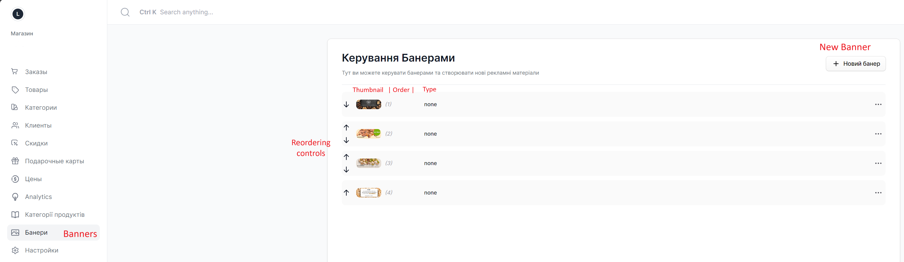
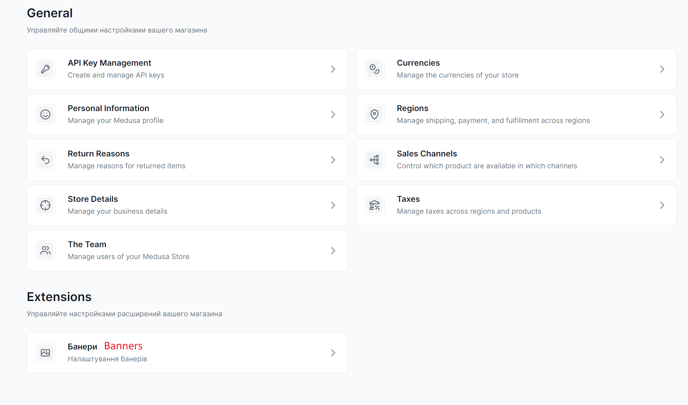
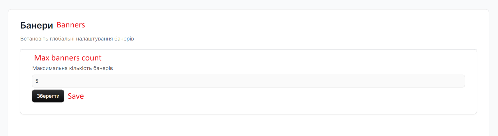
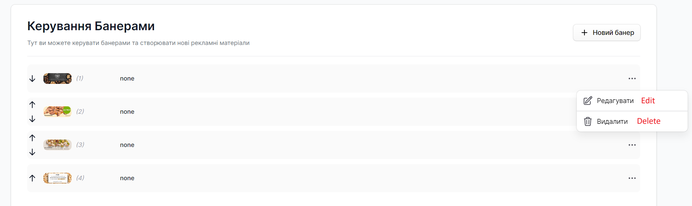
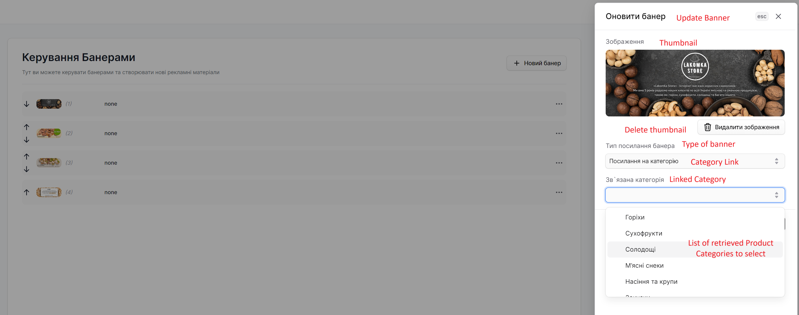
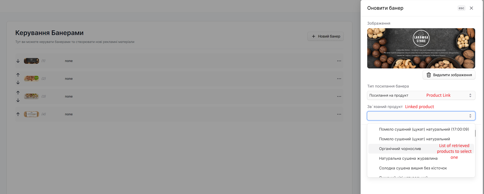
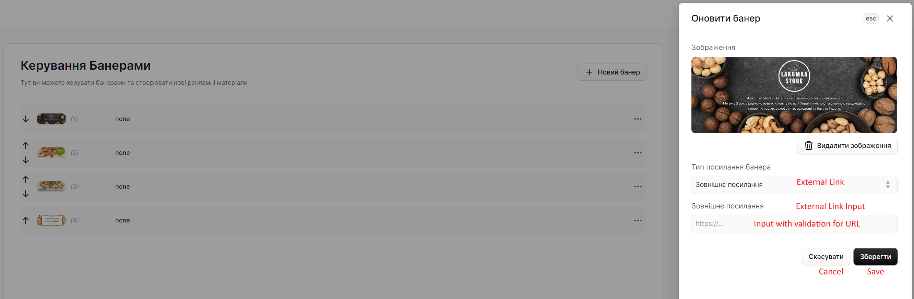
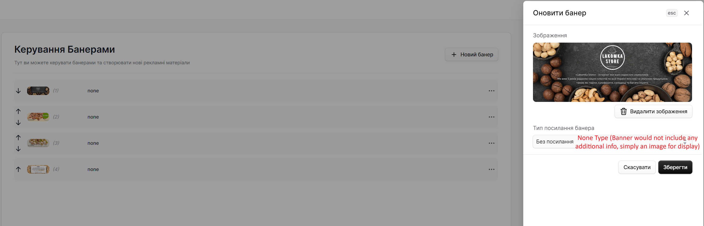

# medusa-plugin-banners
A medusa.js plugin for a banners with relations to other medusa.js entities. For now only available language of UI is Ukrainian, but I'm working on a translations.

[Medusa Website](https://medusajs.com/) | [Medusa Repository](https://github.com/medusajs/medusa)

## Features

- Adding banner images
- Ordering banners
- Retrieval of banner sorted by order by Store API
- Settings for limiting max amount of banners (hardcoded upper max limit - 100)
- Relations to another Medusa.js entities
- Easy UI management of all banners and banners settings (**WARNING:** only available language - **Ukrainian**, for now)

---

## Types of Relations

Useful for retrieval of information from banner in regards to which entitiy it points to. All entities goes through checks, so you don't have to worry if it exists or not, in case if it isn't - service will throw error.

1. Product - relation to **Id** of Medusa.js Product.
2. Category - relation to **Id** of Medusa.js ProductCategory.
3. Page - non functional (**WIP**)
4. Link - simply stores **URL** that user passes in Admin UI.
5. None - banners with that type is simply for display, without any information related to it.

Type of banner can be updated after creation.

---

## Prerequisites

- [Medusa backend](https://docs.medusajs.com/development/backend/install)

---

## How to Install

1\. Run the following command in the directory of the Medusa backend:

```bash
yarn add medusa-plugin-banners
```

2\. In `medusa-config.js` add the following configuration at the end of the `plugins` array:

```js
const plugins = [
  // ...
  {
    resolve: `medusa-plugin-banners`,
    options: {
      enableUI: true,
    },
  },
];
```

---

## Banner Models

Main model of Banner that stored in DB. Includes:

1. Rank - used for ordering of banners.
2. Type - used for consistency control and to understand how to display banner in frontend UI.
3. ProductId - mandatory ID of Medusa Product if selected type is Product. Used for linking to Product on retrieval.
4. ProductId - mandatory ID of Medusa Product Category if selected type is Product Category. Used for linking to Product Category on retrieval (**WARNING** Don't forget to enable product categories experimental flag if you're on Medusa.js of 1 version).
5. Link - mandatory URL if selected type is Link.
6. Thumbnail - url of image of banner.

```js
class Banner extends SoftDeletableEntity {
    @Column({type: 'int', nullable: false, default: 0})
    rank: number;

    @Column({
        type: "enum",
        enum: BannerType,
        default: BannerType.NONE,
    })
    type: BannerType;

    @Column({type: 'text', nullable: true})
    productId?: string | null;

    @Column({type: 'text', nullable: true})
    categoryId?: string | null;

    @Column({type: 'text', nullable: true})
    link: string | null;

    @Column({type: 'text', nullable: true})
    thumbnail?: string | null;

    @BeforeInsert()
    private beforeInsert(): void {
        this.id = generateEntityId(this.id, "banner")
    }
}
```

View Model that used in Store API and later in frontend UI. Further extends Banner model with optional fields of retrieved **Product** or **ProductCategory** linked entities.

```js
class ExtendedBanner extends Banner {
    product: Product | {}
    category: ProductCategory | {}
}
```

---

## Screenshots

















---

## REST API Endpoints

#### Store Endpoints:

1. `/store/banners`:
- GET with optional query parameters of **limit** and **offset**
- Returns list of banners sorted by order. Banners include fields **product** and **category** if banner is of the respctive type and have and related object linked to it by ID.
2. `/store/banners/[id]`:
- GET with mandatory query parameter of **ID** of banner
- Returns banner by **ID** if it exists. Banner include fields **product** and **category** if banner is of the respctive type and have and related object linked to it by ID.

---

## Homepage

- [Product categories with thumbnail and visits count](https://github.com/KreischerPanoptic/medusa-plugin-top-categories)

---
